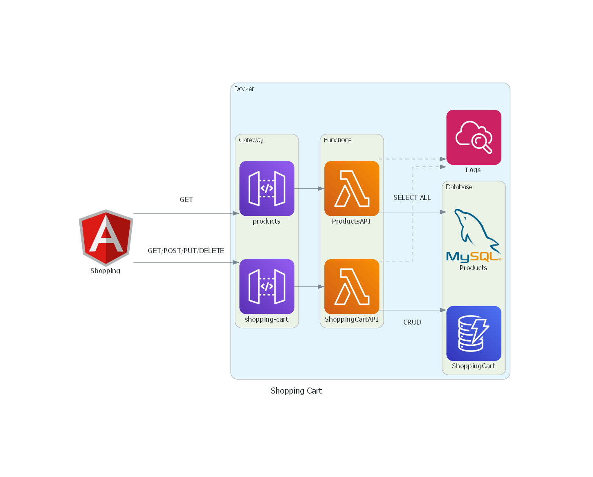

# Shopping Cart Application

This project is a full-stack application designed to manage a shopping cart. It includes a front-end built with Angular and two backend services written as AWS Lambda functions in Go. The application uses MySQL for data storage and LocalStack to emulate AWS services locally.

## Architecture Diagram



## Technologies

- **Angular**: Frontend framework for building the user interface.
- **Go**: Programming language used for the backend Lambda functions.
- **MySQL**: Relational database for storing products data.
- **Docker**: Containerization platform used for deploying the application and its dependencies.
- **LocalStack**: A fully functional local AWS cloud stack, emulating AWS services like DynamoDB and Lambda.

## Applications

### Frontend Application (Angular)

- **Location**: `apps/front/shop`
- **Description**: The Angular application provides a user interface for browsing products and managing the shopping cart.
- **Key Features**:
  - Product listing with search and filter options.
  - Shopping cart management (add, remove, update items).
  - Integration with backend APIs for real-time data.

### Backend Lambda Functions (Go)

#### Products Lambda

- **Location**: `apps/products`
- **Description**: A Go-based AWS Lambda function responsible for handling product-related operations.
- **Key Features**:
  - List all products.
  - Integration with MySQL.
  - Deployed locally using LocalStack for development and testing.

#### b. Shopping Cart Lambda

- **Location**: `apps/shopping-cart`
- **Description**: A Go-based AWS Lambda function that manages shopping cart operations.
- **Key Features**:
  - Managing cart items (adding, removing, updating, list).
  - Integration with DynamoDB for persistent cart storage.
  - Deployed locally using LocalStack for development and testing.

## AWS Resources in LocalStack

LocalStack is used to emulate the following AWS services locally:

1. **DynamoDB**:

   - **Usage**: Storing non-relational data used by the shopping cart lambda.
   - **Setup**: The table schemas are defined and initialized during application startup.

2. **Lambda**:

   - **Usage**: Running serverless functions for product and shopping cart services.
   - **Setup**: Lambda functions for product and shopping cart services are defined and deployed locally through LocalStack.

3. **API Gateway**:

   - **Usage**: Exposing Lambda functions as HTTP endpoints.
   - **Setup**: API Gateway is used to create RESTful endpoints for the Lambda functions.

## MySQL Database

- **Description**: A MySQL database is used for storing products data.
- **Setup**: The database is initialized with seed data through scripts located in the `scripts/mysql` directory.

## Getting Started

### Prerequisites

- **Docker**: Make sure Docker is installed on your machine.
- **Go**: Required for building the Lambda functions locally.
- **Node.js and npm**: Required for local development of the frontend if not using Docker.

### Installation

1. **Clone the repository**:

   ```bash
   git clone https://github.com/andersonbalves/shopping-cart.git
   cd shopping-cart
   ```

2. **Start the Docker containers**:
   Ensure Docker is running, then execute:

   ```bash
   docker-compose up
   ```

   This will start the MySQL database, LocalStack, and any other services defined in the `compose.yaml` file.

   - **LocalStack services included**:
     - DynamoDB
     - Lambdas
     - API Gateway

3. **Frontend Setup & Start**:
   The frontend application is built with Angular. To install dependencies, navigate to the `apps/front/shop` directory and run:

   ```bash
   npm install
   ```

   After installing the dependencies, start the Angular application using:

   ```bash
   npm start
   ```

### Running the Application

- **Frontend**: Access the Angular application at `http://localhost:4200`.
- **Backend Lambda Functions**: Interact with the Lambda functions through their respective endpoints, accessible via LocalStack.
- **LocalStack**: AWS services can be accessed locally on the ports defined in the `compose.yaml`.

## Directory Structure

- **/apps**: Contains the frontend and backend applications.
- **/scripts**: Initialization scripts for services such as MySQL.
- **/images**: Docker images and configurations.
- **compose.yaml**: Docker Compose file for setting up the local environment.

## License

This project is licensed under the MIT License - see the LICENSE file for details.
